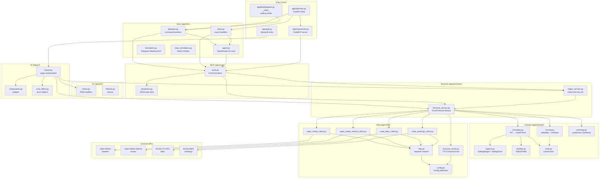
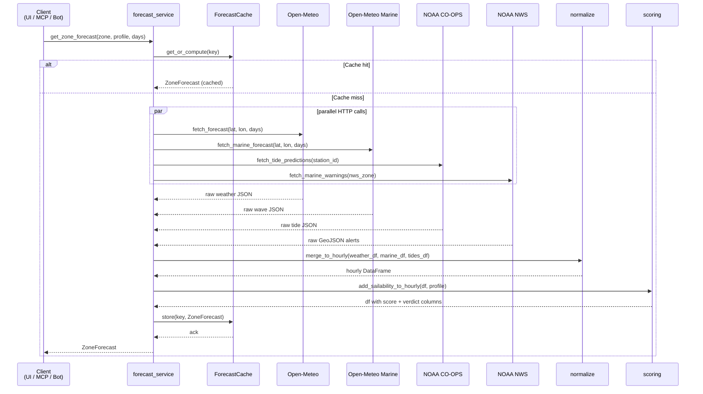

# Architecture

This document describes how the California Sail application is structured at every level: conceptual layers, runtime processes, external dependencies, and request/data flows.

---

## 1. Conceptual layers

```
┌─────────────────────────────────────────────────────────────────┐
│  Clients / Entry points                                         │
│  ┌──────────┐  ┌─────────────┐  ┌────────────┐  ┌──────────┐  │
│  │Streamlit │  │ Telegram /  │  │  MCP AI    │  │  Slack   │  │
│  │   UI     │  │  Slack bot  │  │  agents    │  │  Slash   │  │
│  └────┬─────┘  └──────┬──────┘  └─────┬──────┘  └────┬─────┘  │
└───────┼───────────────┼───────────────┼───────────────┼────────┘
        │               │               │               │
┌───────▼───────────────▼───────────────▼───────────────▼────────┐
│  Service layer  (app/services/)                                 │
│  ┌────────────────────────┐  ┌─────────────────────────────┐   │
│  │  forecast_service.py   │  │  region_service.py          │   │
│  │  ZoneForecast factory  │  │  multi-zone fan-out         │   │
│  └────────────────────────┘  └─────────────────────────────┘   │
└───────────────────────────────────────────────────────────────-─┘
        │                               │
┌───────▼───────────────────────────────▼────────────────────────┐
│  Domain layer  (app/domain/)                                    │
│  ┌───────────┐  ┌───────────┐  ┌────────────┐  ┌───────────┐  │
│  │ regions   │  │ profiles  │  │ normalize  │  │ scoring   │  │
│  │ (models)  │  │ (YAML)    │  │ (pandas)   │  │ (algo)    │  │
│  └───────────┘  └───────────┘  └────────────┘  └───────────┘  │
│  ┌───────────┐  ┌───────────┐                                  │
│  │  units    │  │ warnings  │                                  │
│  │ (helpers) │  │ (synth.)  │                                  │
│  └───────────┘  └───────────┘                                  │
└────────────────────────────────────────────────────────────────┘
        │
┌───────▼────────────────────────────────────────────────────────┐
│  Infrastructure layer  (app/infra/)                            │
│  ┌───────────┐  ┌────────────┐  ┌───────────┐  ┌───────────┐  │
│  │  config   │  │  http.py   │  │  forecast │  │  logging  │  │
│  │  (.env)   │  │  session   │  │  _cache   │  │  setup    │  │
│  └───────────┘  └────────────┘  └───────────┘  └───────────┘  │
│  ┌───────────┐  ┌────────────┐  ┌───────────┐  ┌───────────┐  │
│  │ open_     │  │ open_      │  │ noaa_     │  │ noaa_     │  │
│  │ meteo_    │  │ meteo_     │  │ tides_    │  │ warnings_ │  │
│  │ client    │  │ marine_    │  │ client    │  │ client    │  │
│  └───────────┘  └────────────┘  └───────────┘  └───────────┘  │
└────────────────────────────────────────────────────────────────┘
        │
┌───────▼────────────────────────────────────────────────────────┐
│  External APIs                                                  │
│  Open-Meteo weather · Open-Meteo Marine · NOAA CO-OPS · NWS   │
└────────────────────────────────────────────────────────────────┘
```

Additionally, three cross-cutting packages sit above the service layer:

| Package | Responsibility |
|---|---|
| `app/mcp/` | Wraps service-layer calls into MCP tool functions; serialises results to JSON |
| `app/bot/` | Telegram bot, Slack bot, NL agent, and text formatters |
| `app/ui/` | Streamlit layout, widgets, and zone-filter helpers |
| `app/viz/` | Plotly chart builders and shared theme tokens |

---

## 2. Runtime processes

Two ASGI/WSGI processes are deployed in production and available locally via Docker Compose:

```
┌──────────────────────────────┐   ┌──────────────────────────────────┐
│  Service: california-sail-ui │   │  Service: california-sail-api    │
│  (Dockerfile.ui)             │   │  (Dockerfile.api)                │
│                              │   │                                  │
│  streamlit run app/app.py    │   │  uvicorn app.api.main:app        │
│  PORT 8501                   │   │  PORT 8080                       │
│                              │   │                                  │
│  • Streamlit page            │   │  GET  /health                    │
│  • Plotly charts             │   │  POST /telegram/webhook          │
│  • st.cache_data             │   │  POST /slack/events              │
│                              │   │  /mcp  (SSE transport)           │
│  Direct HTTP calls to        │   │                                  │
│  external weather APIs       │   │  Mounts MCP SSE app              │
│                              │   │  Runs Telegram webhook loop      │
└──────────────────────────────┘   │  Runs Slack Bolt handler         │
                                   │  TTLForecastCache (15 min)       │
                                   └──────────────────────────────────┘
```

For local development without Docker, a third mode exists:

```
python -m app.bot.telegram      # Telegram polling (replaces webhook)
python -m app.mcp.server        # MCP stdio (for Cursor / Claude Desktop)
```

---

## 3. Full component map



---

## 4. Data flow — single zone forecast



---

## 5. Deployment topology on GCP

```
┌──────────────── GCP project: sermolin-2026 ──────────────────────┐
│                                                                   │
│  Artifact Registry                                                │
│  us-west1-docker.pkg.dev/sermolin-2026/california-sail/           │
│  ├── california-sail-ui:latest                                    │
│  └── california-sail-api:latest                                   │
│                                                                   │
│  Cloud Run (us-west1)                                             │
│  ┌──────────────────────────┐  ┌──────────────────────────────┐  │
│  │ california-sail-ui       │  │ california-sail-api          │  │
│  │ 512 Mi, port 8501        │  │ 512 Mi, port 8080            │  │
│  │ no inbound secrets       │  │ secret: TELEGRAM_BOT_TOKEN   │  │
│  │                          │  │ env: WEBHOOK_URL             │  │
│  │ public HTTPS endpoint    │  │ public HTTPS endpoint        │  │
│  └──────────────────────────┘  └──────────────────────────────┘  │
│                                         │                        │
│  Secret Manager                         │ reads secret           │
│  └── TELEGRAM_BOT_TOKEN ────────────────┘                        │
│                                                                   │
│  Cloud Build                                                      │
│  ├── cloudbuild.ui.yaml  → builds Dockerfile.ui                   │
│  └── cloudbuild.api.yaml → builds Dockerfile.api                  │
│                                                                   │
└──────────────────────────────────────────────────────────────────┘
                │                         │
         Telegram API               Cursor / Claude
         (webhook POST)             (MCP SSE or stdio)
```

---

## 6. Caching strategy

The same forecast service function is called from two very different runtimes:

| Runtime | Cache backend | Implementation |
|---|---|---|
| Streamlit UI | `st.cache_data` (per-process, in-memory, TTL) | `_st_get_zone_forecast` decorated with `@st.cache_data` |
| MCP server / bots / API | `TTLForecastCache` (thread-safe `cachetools.TTLCache`) | Passed explicitly as `cache=` argument |

`get_zone_forecast(zone, profile, days, cache=None)` — when `cache` is `None` or `StreamlitForecastCache`, it delegates to `_st_get_zone_forecast`; otherwise it calls `cache.get_or_compute(key, ttl, compute_fn)`.

The default TTL is 900 seconds (15 minutes), configurable via `CACHE_TTL_SECONDS` in `.env`.

---

## 7. External API summary

| API | Provider | Data | Rate limit |
|---|---|---|---|
| Open-Meteo forecast | open-meteo.com | Hourly: wind speed/dir/gusts, temp, precip, cloud cover, visibility | Free, no key |
| Open-Meteo Marine | open-meteo.com | Hourly: wave height, wave period, wave direction | Free, no key |
| NOAA CO-OPS | tidesandcurrents.noaa.gov | Hourly tide height predictions | Free, no key |
| NOAA NWS | api.weather.gov | Marine zone warnings (GeoJSON) | Free, no key |

Sardinia has no NOAA coverage; warnings are synthesised from the forecast data in `app/domain/warnings.py`.
