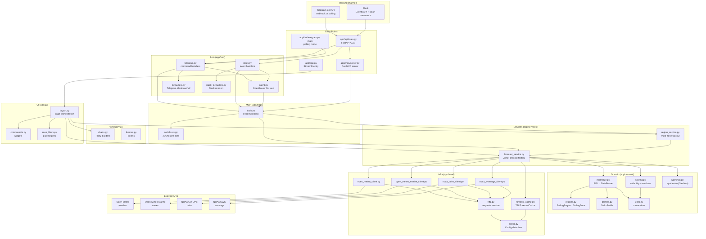
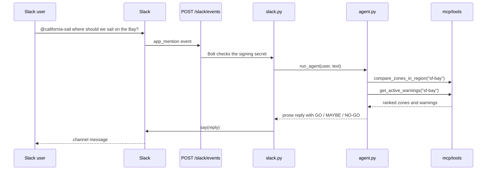
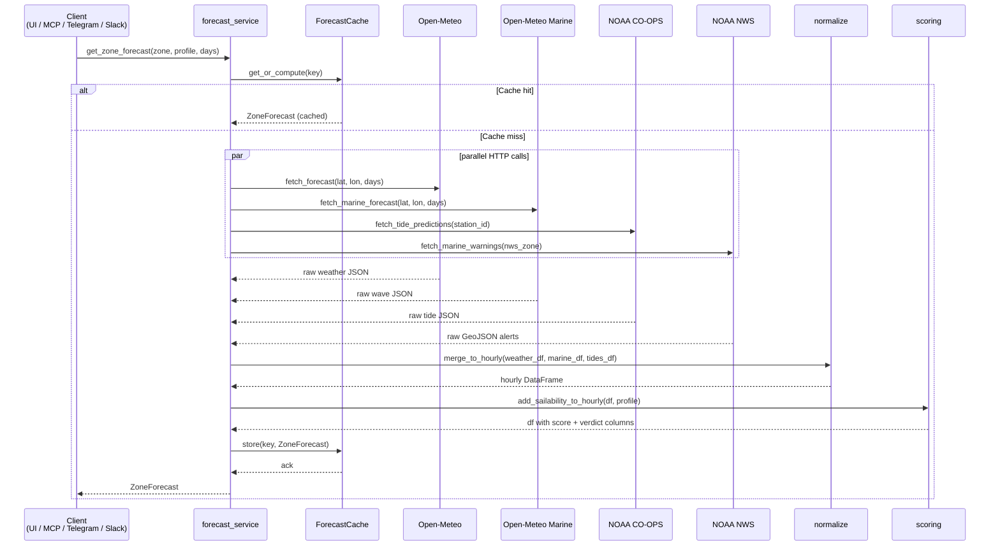

# Architecture

This document describes how the California Sail application is structured at every level: conceptual layers, runtime processes, external dependencies, and request/data flows.

---

## 1. Conceptual layers

```
┌─────────────────────────────────────────────────────────────────┐
│  Clients / Entry points                                         │
│  ┌──────────┐  ┌─────────────┐  ┌────────────┐  ┌──────────┐    │
│  │Streamlit │  │  Telegram   │  │   Slack    │  │  MCP AI  │    │
│  │   UI     │  │  channel    │  │  channel   │  │  agents  │    │
│  └────┬─────┘  └──────┬──────┘  └─────┬──────┘  └─────┬────┘    │
└───────┼───────────────┼───────────────┼───────────────┼─────────┘
        │               │               │               │
┌───────▼───────────────▼───────────────▼───────────────▼────────┐
│  Service layer  (app/services/)                                 │
│  ┌────────────────────────┐  ┌─────────────────────────────┐   │
│  │  forecast_service.py   │  │  region_service.py          │   │
│  │  ZoneForecast factory  │  │  multi-zone fan-out         │   │
│  └────────────────────────┘  └─────────────────────────────┘   │
└───────────────────────────────────────────────────────────────-─┘
        │                               │
┌───────▼───────────────────────────────▼────────────────────────┐
│  Domain layer  (app/domain/)                                    │
│  ┌───────────┐  ┌───────────┐  ┌────────────┐  ┌───────────┐  │
│  │ regions   │  │ profiles  │  │ normalize  │  │ scoring   │  │
│  │ (models)  │  │ (YAML)    │  │ (pandas)   │  │ (algo)    │  │
│  └───────────┘  └───────────┘  └────────────┘  └───────────┘  │
│  ┌───────────┐  ┌───────────┐                                  │
│  │  units    │  │ warnings  │                                  │
│  │ (helpers) │  │ (synth.)  │                                  │
│  └───────────┘  └───────────┘                                  │
└────────────────────────────────────────────────────────────────┘
        │
┌───────▼────────────────────────────────────────────────────────┐
│  Infrastructure layer  (app/infra/)                            │
│  ┌───────────┐  ┌────────────┐  ┌───────────┐  ┌───────────┐  │
│  │  config   │  │  http.py   │  │  forecast │  │  logging  │  │
│  │  (.env)   │  │  session   │  │  _cache   │  │  setup    │  │
│  └───────────┘  └────────────┘  └───────────┘  └───────────┘  │
│  ┌───────────┐  ┌────────────┐  ┌───────────┐  ┌───────────┐  │
│  │ open_     │  │ open_      │  │ noaa_     │  │ noaa_     │  │
│  │ meteo_    │  │ meteo_     │  │ tides_    │  │ warnings_ │  │
│  │ client    │  │ marine_    │  │ client    │  │ client    │  │
│  └───────────┘  └────────────┘  └───────────┘  └───────────┘  │
└────────────────────────────────────────────────────────────────┘
        │
┌───────▼────────────────────────────────────────────────────────┐
│  External APIs                                                  │
│  Open-Meteo weather · Open-Meteo Marine · NOAA CO-OPS · NWS   │
└────────────────────────────────────────────────────────────────┘
```

Additionally, four cross-cutting packages sit above the service layer. Telegram and Slack are peer clients of that layer: each channel adapter lives in `app/bot/` and reaches forecasts only through `app/mcp/tools` or the shared natural-language agent.

| Package | Responsibility |
|---|---|
| `app/mcp/` | Wraps service-layer calls into MCP tool functions; serialises results to JSON |
| `app/bot/` | Telegram bot, Slack bot, NL agent, and text formatters |
| `app/ui/` | Streamlit layout, widgets, and zone-filter helpers |
| `app/viz/` | Plotly chart builders and shared theme tokens |

---

## 2. Runtime processes

Two ASGI/WSGI processes are deployed in production and available locally via Docker Compose:

```
┌──────────────────────────────┐   ┌──────────────────────────────────┐
│  Service: california-sail-ui │   │  Service: california-sail-api    │
│  (Dockerfile.ui)             │   │  (Dockerfile.api)                │
│                              │   │                                  │
│  streamlit run app/app.py    │   │  uvicorn app.api.main:app        │
│  PORT 8501                   │   │  PORT 8080                       │
│                              │   │                                  │
│  • Streamlit page            │   │  GET  /health                    │
│  • Plotly charts             │   │  POST /telegram/webhook          │
│  • st.cache_data             │   │  POST /slack/events              │
│                              │   │  /mcp  (SSE transport)           │
│  Direct HTTP calls to        │   │                                  │
│  external weather APIs       │   │  Mounts MCP SSE app              │
│                              │   │  Runs Telegram webhook loop      │
└──────────────────────────────┘   │  Runs Slack Bolt handler         │
                                   │  TTLForecastCache (15 min)       │
                                   └──────────────────────────────────┘
```

For local development without Docker, a third mode exists:

```
python -m app.bot.telegram      # Telegram polling (replaces webhook)
python -m app.mcp.server        # MCP stdio (for Cursor / Claude Desktop)
uvicorn app.api.main:app        # Slack channel: POST /slack/events
```

Slack has no polling process. The Slack app's request URL must be able to reach `POST /slack/events` on this API process.

---

## 3. Full component map


```mermaid
graph TB
    subgraph chat["Inbound channels"]
        TGAPI["Telegram Bot API<br/>webhook or polling"]
        SLAPI["Slack<br/>Events API + slash commands"]
    end

    subgraph entry["Entry Points"]
        APP["app/app.py<br/>Streamlit entry"]
        APIMAIN["app/api/main.py<br/>FastAPI ASGI"]
        MCPSERVER["app/mcp/server.py<br/>FastMCP server"]
        TGPOLL["app/bot/telegram.py __main__<br/>polling mode"]
    end

    subgraph ui["UI (app/ui/)"]
        LAYOUT["layout.py<br/>page orchestration"]
        COMP["components.py<br/>widgets"]
        ZF["zone_filters.py<br/>pure helpers"]
    end

    subgraph viz["Viz (app/viz/)"]
        CHARTS["charts.py<br/>Plotly builders"]
        THEMES["themes.py<br/>tokens"]
    end

    subgraph bots["Bots (app/bot/)"]
        TG["telegram.py<br/>command handlers"]
        SL["slack.py<br/>event handlers"]
        AGENT["agent.py<br/>OpenRouter NL loop"]
        FMT["formatters.py<br/>Telegram MarkdownV2"]
        SFMT["slack_formatters.py<br/>Slack mrkdwn"]
    end

    subgraph mcp["MCP (app/mcp/)"]
        TOOLS["tools.py<br/>8 tool functions"]
        SER["serializers.py<br/>JSON-safe dicts"]
    end

    subgraph svc["Services (app/services/)"]
        FS["forecast_service.py<br/>ZoneForecast factory"]
        RS["region_service.py<br/>multi-zone fan-out"]
    end

    subgraph domain["Domain (app/domain/)"]
        REG["regions.py<br/>SailingRegion / SailingZone"]
        PROF["profiles.py<br/>SailorProfile"]
        NORM["normalize.py<br/>API → DataFrame"]
        SCORE["scoring.py<br/>sailability + windows"]
        UNITS["units.py<br/>conversions"]
        WARN["warnings.py<br/>synthesize (Sardinia)"]
    end

    subgraph infra["Infra (app/infra/)"]
        CFG["config.py<br/>Config dataclass"]
        HTTP["http.py<br/>requests session"]
        CACHE["forecast_cache.py<br/>TTLForecastCache"]
        OM["open_meteo_client.py"]
        MAR["open_meteo_marine_client.py"]
        NOAAT["noaa_tides_client.py"]
        NOAAW["noaa_warnings_client.py"]
    end

    subgraph ext["External APIs"]
        OME["Open-Meteo<br/>weather"]
        OMEM["Open-Meteo Marine<br/>waves"]
        NOAAC["NOAA CO-OPS<br/>tides"]
        NWS["NOAA NWS<br/>warnings"]
    end

    TGAPI --> APIMAIN
    SLAPI --> APIMAIN
    APP --> LAYOUT
    LAYOUT --> COMP & CHARTS & ZF & FS & RS
    APIMAIN --> TG & SL & MCPSERVER
    TG --> FMT
    SL --> SFMT
    TGPOLL --> TG
    TG & SL --> TOOLS & AGENT
    AGENT --> TOOLS
    TOOLS --> FS & RS & SER
    MCPSERVER --> TOOLS
    FS --> NORM & SCORE & WARN & OM & MAR & NOAAT & NOAAW & CACHE
    RS --> FS
    NORM --> REG & PROF & UNITS
    SCORE --> UNITS
    OM --> HTTP & OME
    MAR --> HTTP & OMEM
    NOAAT --> HTTP & NOAAC
    NOAAW --> HTTP & NWS
    HTTP --> CFG
    CACHE --> CFG
```

---

## 4. Messaging channels

Telegram and Slack are peer channels on the API process. Each one is an adapter in `app/bot/`. The adapter checks the platform's credentials, accepts the incoming message, and either calls `app.mcp.tools` or the shared natural-language agent. Scoring, caching, and the weather clients are the same code the UI and the MCP server use.

| | Telegram | Slack |
|---|---|---|
| Adapter | `app/bot/telegram.py` | `app/bot/slack.py` |
| Formatter | `app/bot/formatters.py` (MarkdownV2) | `app/bot/slack_formatters.py` (mrkdwn) |
| Production ingress | `POST /telegram/webhook` | `POST /slack/events` |
| Local mode | `python -m app.bot.telegram` (polling) | The same API route; Slack must reach a public URL |
| Structured queries | `/regions`, `/zones`, `/profiles`, `/forecast`, `/compare`, `/windows`, `/warnings`, `/explain` | The same names, registered as slash commands |
| Plain language | Any message that is not a command | Direct messages and `app_mention` |
| Credentials | `TELEGRAM_BOT_TOKEN` | `SLACK_BOT_TOKEN`, `SLACK_SIGNING_SECRET` |

Both channels share `app/bot/agent.py`. `run_agent` keeps a short per-user history and asks OpenRouter to call the MCP tools. Slack user IDs are strings, so `_slack_uid` hashes them to the integer key that history store expects. `run_agent` is synchronous, so both handlers call it with `asyncio.to_thread` and leave the event loop free while OpenRouter responds. Slash commands and Telegram commands skip the agent: they call the tool functions directly, then the channel formatter renders the dict.

Asking where to sail from Slack:


```mermaid
sequenceDiagram
    participant User as Slack user
    participant Slack as Slack
    participant API as POST /slack/events
    participant Bot as slack.py
    participant Agent as agent.py
    participant Tools as mcp/tools

    User->>Slack: @california-sail where should we sail on the Bay?
    Slack->>API: app_mention event
    API->>Bot: Bolt checks the signing secret
    Bot->>Agent: run_agent(user, text)
    Agent->>Tools: compare_zones_in_region("sf-bay")
    Agent->>Tools: get_active_warnings("sf-bay")
    Tools-->>Agent: ranked zones and warnings
    Agent-->>Bot: prose reply with GO / MAYBE / NO-GO
    Bot->>Slack: say(reply)
    Slack-->>User: channel message
```

A slash command such as `/compare sf-bay cruiser` takes the shorter path. Bolt acknowledges the command, `slack.py` calls `compare_zones_in_region` and `get_active_warnings`, and `format_compare` renders Slack mrkdwn. That path does not call OpenRouter.

If either Slack secret is missing, `build_slack_handler()` returns nothing and `POST /slack/events` responds with 503. The Telegram channel keeps running.

---

## 5. Data flow — single zone forecast


```mermaid
sequenceDiagram
    participant Client as Client<br/>(UI / MCP / Telegram / Slack)
    participant FS as forecast_service
    participant Cache as ForecastCache
    participant OM as Open-Meteo
    participant Marine as Open-Meteo Marine
    participant NOAA as NOAA CO-OPS
    participant NWS as NOAA NWS
    participant N as normalize
    participant S as scoring

    Client->>FS: get_zone_forecast(zone, profile, days)
    FS->>Cache: get_or_compute(key)
    alt Cache hit
        Cache-->>FS: ZoneForecast (cached)
    else Cache miss
        par parallel HTTP calls
            FS->>OM: fetch_forecast(lat, lon, days)
            FS->>Marine: fetch_marine_forecast(lat, lon, days)
            FS->>NOAA: fetch_tide_predictions(station_id)
            FS->>NWS: fetch_marine_warnings(nws_zone)
        end
        OM-->>FS: raw weather JSON
        Marine-->>FS: raw wave JSON
        NOAA-->>FS: raw tide JSON
        NWS-->>FS: raw GeoJSON alerts
        FS->>N: merge_to_hourly(weather_df, marine_df, tides_df)
        N-->>FS: hourly DataFrame
        FS->>S: add_sailability_to_hourly(df, profile)
        S-->>FS: df with score + verdict columns
        FS->>Cache: store(key, ZoneForecast)
        Cache-->>FS: ack
        FS-->>Client: ZoneForecast
    end
```

---

## 6. Deployment topology on GCP

```
┌──────────────── GCP project: sermolin-2026 ──────────────────────┐
│                                                                   │
│  Artifact Registry                                                │
│  us-west1-docker.pkg.dev/sermolin-2026/california-sail/           │
│  ├── california-sail-ui:latest                                    │
│  └── california-sail-api:latest                                   │
│                                                                   │
│  Cloud Run (us-west1)                                             │
│  ┌──────────────────────────┐  ┌──────────────────────────────┐  │
│  │ california-sail-ui       │  │ california-sail-api          │  │
│  │ 512 Mi, port 8501        │  │ 512 Mi, port 8080            │  │
│  │ no inbound secrets       │  │ TELEGRAM_BOT_TOKEN           │  │
│  │                          │  │ SLACK_BOT_TOKEN              │  │
│  │                          │  │ SLACK_SIGNING_SECRET         │  │
│  │ public HTTPS endpoint    │  │ WEBHOOK_URL                  │  │
│  └──────────────────────────┘  └──────────────────────────────┘  │
│                                         │                        │
│  Secret Manager                         │ reads secrets          │
│  ├── TELEGRAM_BOT_TOKEN ────────────────┤                        │
│  ├── SLACK_BOT_TOKEN ───────────────────┤                        │
│  └── SLACK_SIGNING_SECRET ──────────────┘                        │
│                                                                   │
│  Cloud Build                                                      │
│  ├── cloudbuild.ui.yaml  → builds Dockerfile.ui                   │
│  └── cloudbuild.api.yaml → builds Dockerfile.api                  │
│                                                                   │
└──────────────────────────────────────────────────────────────────┘
         │                    │                    │
   Telegram Bot API     Slack Events API    Cursor / Claude
   /telegram/webhook    /slack/events       MCP SSE or stdio
```

Slack delivers slash commands, `app_mention` events, and direct messages to `POST /slack/events` on `california-sail-api`. The API reads `SLACK_BOT_TOKEN` and `SLACK_SIGNING_SECRET` from the environment, the same place it reads `TELEGRAM_BOT_TOKEN`. `scripts/deploy.sh` currently mounts only the Telegram secret; until both Slack values are present, that route returns 503 and the Slack channel stays off.

---

## 7. Caching strategy

The same forecast service function is called from two very different runtimes:

| Runtime | Cache backend | Implementation |
|---|---|---|
| Streamlit UI | `st.cache_data` (per-process, in-memory, TTL) | `_st_get_zone_forecast` decorated with `@st.cache_data` |
| MCP server / Telegram / Slack / API | `TTLForecastCache` (thread-safe `cachetools.TTLCache`) | Passed explicitly as `cache=` argument |

`get_zone_forecast(zone, profile, days, cache=None)` — when `cache` is `None` or `StreamlitForecastCache`, it delegates to `_st_get_zone_forecast`; otherwise it calls `cache.get_or_compute(key, ttl, compute_fn)`.

The default TTL is 900 seconds (15 minutes), configurable via `CACHE_TTL_SECONDS` in `.env`.

---

## 8. External API summary

| API | Provider | Data | Rate limit |
|---|---|---|---|
| Open-Meteo forecast | open-meteo.com | Hourly: wind speed/dir/gusts, temp, precip, cloud cover, visibility | Free, no key |
| Open-Meteo Marine | open-meteo.com | Hourly: wave height, wave period, wave direction | Free, no key |
| NOAA CO-OPS | tidesandcurrents.noaa.gov | Hourly tide height predictions | Free, no key |
| NOAA NWS | api.weather.gov | Marine zone warnings (GeoJSON) | Free, no key |

Sardinia has no NOAA coverage; warnings are synthesised from the forecast data in `app/domain/warnings.py`.
