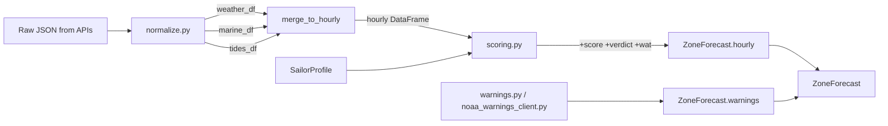

# Domain Model

This document describes the core data structures, configuration files, and the sailability scoring algorithm.

---

## 1. Configuration YAML files

### `data/sailing_areas.yaml` — Regions and zones

This file is the single source of truth for all geographic knowledge. It is loaded at startup by `app.domain.regions.load_regions()`.

**Top-level structure:**

```yaml
regions:
  - id: sf-bay
    name: San Francisco Bay
    country: US
    timezone: America/Los_Angeles
    zones:
      - id: city-front
        name: City Front
        latitude: 37.799
        longitude: -122.407
        exposure: open          # open | sheltered | channel
        hazards:
          - "Strong ebb current through Golden Gate"
          - "Afternoon sea breeze 20-30 kt common"
        flood_dir_deg: 90       # compass heading of flood current
        tide_station_id: "9414290"   # NOAA CO-OPS station
        nws_zone: "PZZ545"     # NOAA NWS marine zone
      # … more zones
```

**Zone fields reference:**

| Field | Type | Required | Description |
|---|---|---|---|
| `id` | string | yes | Unique within the region; used as key in all API calls |
| `name` | string | yes | Display name |
| `latitude` | float | yes | WGS-84 decimal latitude |
| `longitude` | float | yes | WGS-84 decimal longitude |
| `exposure` | string | yes | `open`, `sheltered`, or `channel` |
| `hazards` | list[string] | no | Free-text hazard descriptions shown in the UI |
| `flood_dir_deg` | float \| null | no | Compass direction of flood current (0 = N, 90 = E). `null` for Sardinia |
| `tide_station_id` | string \| null | no | NOAA CO-OPS station ID. `null` for Sardinia |
| `nws_zone` | string \| null | no | NOAA NWS marine zone code. `null` for Sardinia |

**Current regions and zones:**

```
sf-bay (San Francisco Bay, US)
├── city-front         (open, tide station 9414290, NWS PZZ545)
├── berkeley-oc        (open)
├── raccoon-strait     (channel)
├── south-bay          (sheltered)
├── richmond-ybc       (open)
├── treasure-island    (open)
├── sausalito          (sheltered)
└── alameda-estuary    (sheltered)

puget-sound (Puget Sound / Seattle, US)
├── shilshole          (open, tide station 9447130, NWS PZZ135)
├── port-townsend      (open)
├── elliott-bay        (sheltered)
├── possession-sound   (open)
├── bainbridge         (sheltered)
├── gig-harbor         (sheltered)
└── des-moines         (sheltered)

sardinia (Sardinia, IT)
├── costa-smeralda     (open)
├── la-maddalena       (channel)
├── bonifacio          (channel)
├── gulf-orosei        (open)
├── cagliari           (sheltered)
├── alghero            (open)
├── stintino           (open)
├── villasimius        (open)
└── carloforte         (sheltered)
```

---

### `data/sailor_profiles.yaml` — Scoring profiles

This file defines the thresholds used by the scoring algorithm. It is loaded by `app.domain.profiles.load_profiles()`.

```yaml
profiles:
  - id: school
    name: School / Beginner
    wind_ideal_min_kt: 5
    wind_ideal_max_kt: 12
    gust_max_kt: 20
    wave_max_m: 1.0
    vis_min_km: 3.0
    low_chop_preference: true
    chop_penalty_threshold_kt: 40     # score drops fast in choppy conditions
    chop_penalty_wave_period_s: 5.0   # short-period waves penalised more
    wat_min_current_kt: 0.5           # wind-against-tide penalty starts here

  - id: cruiser                       # default profile
    name: Cruiser
    wind_ideal_min_kt: 10
    wind_ideal_max_kt: 18
    gust_max_kt: 30
    wave_max_m: 2.5
    vis_min_km: 1.0
    low_chop_preference: false
    chop_penalty_threshold_kt: 25
    chop_penalty_wave_period_s: 4.0
    wat_min_current_kt: 1.0

  - id: racer
    name: Racer
    wind_ideal_min_kt: 14
    wind_ideal_max_kt: 25
    gust_max_kt: 35
    wave_max_m: 3.5
    vis_min_km: 1.0
    low_chop_preference: false
    chop_penalty_threshold_kt: 15
    chop_penalty_wave_period_s: 3.0
    wat_min_current_kt: 1.5
```

**Profile fields reference:**

| Field | Description |
|---|---|
| `wind_ideal_min_kt` | Lower bound of ideal wind speed (knots) |
| `wind_ideal_max_kt` | Upper bound of ideal wind speed |
| `gust_max_kt` | Hard safety ceiling; gust above this = hard penalty |
| `wave_max_m` | Hard safety ceiling for wave height (metres) |
| `vis_min_km` | Minimum acceptable visibility (kilometres) |
| `low_chop_preference` | If `true`, extra penalty is applied for short-period choppy waves |
| `chop_penalty_threshold_kt` | Score at which choppy conditions start to hurt (beginners care more) |
| `chop_penalty_wave_period_s` | Wave period (seconds) below which chop penalty kicks in |
| `wat_min_current_kt` | Minimum tidal current speed for Wind-Against-Tide check |

---

## 2. Python domain objects

### `SailingZone`

```python
@dataclass
class SailingZone:
    id: str
    name: str
    latitude: float
    longitude: float
    exposure: str                    # "open" | "sheltered" | "channel"
    hazards: list[str]
    flood_dir_deg: float | None      # None for Sardinia
    tide_station_id: str | None      # None for Sardinia
    nws_zone: str | None             # None for Sardinia
```

### `SailingRegion`

```python
@dataclass
class SailingRegion:
    id: str
    name: str
    country: str
    timezone: str                    # IANA tz name e.g. "America/Los_Angeles"
    zones: list[SailingZone]
```

### `SailorProfile`

```python
@dataclass
class SailorProfile:
    id: str
    name: str
    wind_ideal_min_kt: float
    wind_ideal_max_kt: float
    gust_max_kt: float
    wave_max_m: float
    vis_min_km: float
    low_chop_preference: bool
    chop_penalty_threshold_kt: float
    chop_penalty_wave_period_s: float
    wat_min_current_kt: float
```

### `ZoneForecast`

The main output object produced by `forecast_service.get_zone_forecast()`:

```python
@dataclass
class ZoneForecast:
    zone: SailingZone
    profile: SailorProfile
    hourly: pd.DataFrame        # see §3 below
    warnings: list[dict]        # see §4 below
    fetched_at: datetime        # UTC timestamp of the fetch
```

---

## 3. Hourly DataFrame schema

The `hourly` DataFrame is the central data structure. Every column is described below:

| Column | dtype | Unit | Source |
|---|---|---|---|
| `time` | DatetimeTZDtype (UTC) | — | Open-Meteo |
| `wind_speed_kt` | float64 | knots | Open-Meteo → `ms_to_knots` |
| `wind_dir_deg` | float64 | degrees | Open-Meteo |
| `wind_gusts_kt` | float64 | knots | Open-Meteo → `ms_to_knots` |
| `temperature_c` | float64 | °C | Open-Meteo |
| `precipitation_mm` | float64 | mm/h | Open-Meteo |
| `cloud_cover_pct` | float64 | % | Open-Meteo |
| `visibility_km` | float64 | km | Open-Meteo |
| `wave_height_m` | float64 | metres | Open-Meteo Marine |
| `wave_period_s` | float64 | seconds | Open-Meteo Marine |
| `wave_dir_deg` | float64 | degrees | Open-Meteo Marine |
| `tide_m` | float64 | metres (MLLW) | NOAA CO-OPS |
| `score` | float64 | 0–100 | Computed by `scoring.py` |
| `verdict` | object (str) | GO/MAYBE/NO-GO | Computed by `scoring.py` |
| `wind_against_tide` | bool | — | Computed by `scoring.py` |

Columns from Open-Meteo Marine and NOAA tides may be `NaN` where data is unavailable (e.g. Sardinia tides).

---

## 4. Warnings schema

The `warnings` list in `ZoneForecast` contains dicts with these keys (same for both NOAA and synthesised):

```python
{
    "event":       str,     # e.g. "Small Craft Advisory"
    "headline":    str,     # one-line summary
    "description": str,     # full description text
    "effective":   str,     # ISO-8601 datetime string
    "expires":     str,     # ISO-8601 datetime string
    "severity":    str,     # "Extreme" | "Severe" | "Moderate" | "Minor"
}
```

---

## 5. Sailability scoring algorithm

The score is computed in `app/domain/scoring.py → add_sailability_to_hourly()` for each hourly row. It is always in the range 0–100.

### Step 1: Wind score (0–40 points)

```
if wind_speed_kt < wind_ideal_min_kt:
    wind_score = 40 * (wind_speed_kt / wind_ideal_min_kt)
elif wind_speed_kt <= wind_ideal_max_kt:
    wind_score = 40
else:
    excess = wind_speed_kt - wind_ideal_max_kt
    wind_score = max(0, 40 - excess * 3)
```

The ideal window [min, max] defined in the profile scores full marks. Wind below the minimum scores proportionally (not enough wind = boring). Wind above the maximum is penalised steeply (3 points per knot over).

### Step 2: Gust penalty (hard gate)

```
if wind_gusts_kt > profile.gust_max_kt:
    gust_penalty = min(40, (wind_gusts_kt - profile.gust_max_kt) * 4)
    wind_score = max(0, wind_score - gust_penalty)
```

### Step 3: Wave score (0–30 points)

```
if wave_height_m <= profile.wave_max_m:
    wave_score = 30 * (1 - wave_height_m / profile.wave_max_m)
else:
    wave_score = 0   # hard gate
```

If `low_chop_preference` is True and `wave_period_s < chop_penalty_wave_period_s`:
```
chop_factor = (chop_penalty_wave_period_s - wave_period_s) / chop_penalty_wave_period_s
wave_score = max(0, wave_score - chop_penalty_threshold_kt * chop_factor)
```

### Step 4: Visibility penalty (0–20 points)

```
if visibility_km >= 10:
    vis_score = 20
elif visibility_km >= profile.vis_min_km:
    vis_score = 20 * (visibility_km / 10)
else:
    vis_score = 0   # hard gate
```

### Step 5: Wind-against-tide (WAT) penalty (0–10 points)

WAT is detected when:
1. `tide_m` data is available (not NaN)
2. `abs(tidal_current_kt) >= profile.wat_min_current_kt` (estimated from tide gradient)
3. `directions_opposed(wind_dir_deg, flood_dir_deg + 180°, threshold=60°)` is `True`

```
if wat_detected:
    wat_penalty = min(10, current_kt * 5)
    score -= wat_penalty
    wind_against_tide = True
```

### Step 6: Final score and verdict

```
score = wind_score + wave_score + vis_score - wat_penalty
score = max(0, min(100, score))

verdict = "GO"    if score >= 65
          "MAYBE" if score >= 35
          "NO-GO" otherwise
```

### Score component summary

```
Component         Max points   Hard gate?
─────────────────────────────────────────
Wind              40           No (tapers off)
Gust              —            Yes (-gust_penalty from wind)
Wave height       30           Yes (0 if > wave_max_m)
Wave chop         —            Penalty subtracted from wave
Visibility        20           Yes (0 if < vis_min_km)
Wind-against-tide —            Up to -10 points
─────────────────────────────────────────
Total             100
```

---

## 6. Best windows

`scoring.best_windows(df, window_hours=3, top_n=3)` finds the top N non-overlapping contiguous time windows with the highest mean score. It uses a sliding window of `window_hours` rows and returns the windows sorted by `avg_score` descending.

Each window dict contains:
```python
{
    "start":     str,   # ISO-8601 start time
    "end":       str,   # ISO-8601 end time
    "avg_score": float,
    "verdict":   str,
}
```

---

## 7. Data flow through the domain layer


